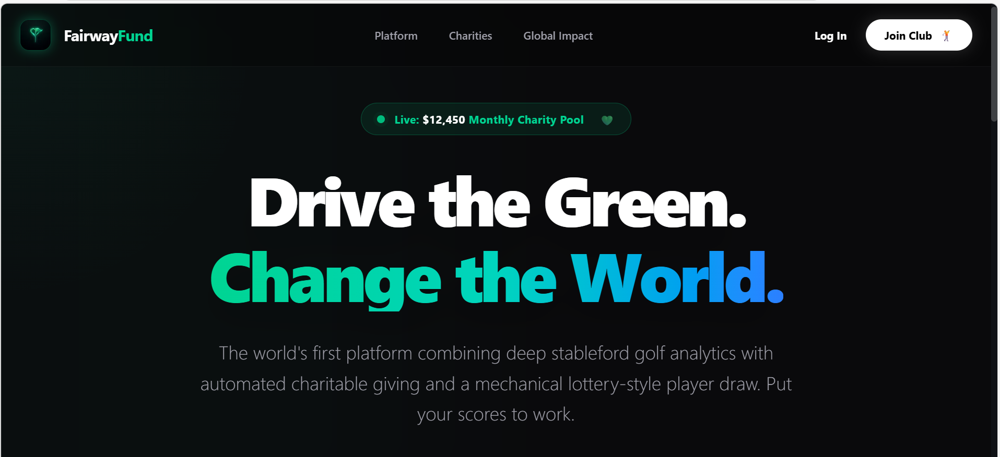
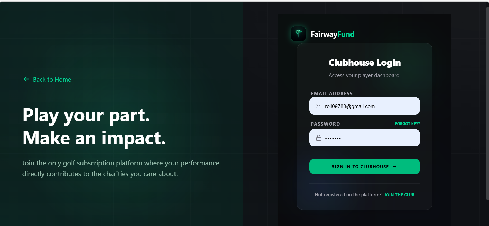
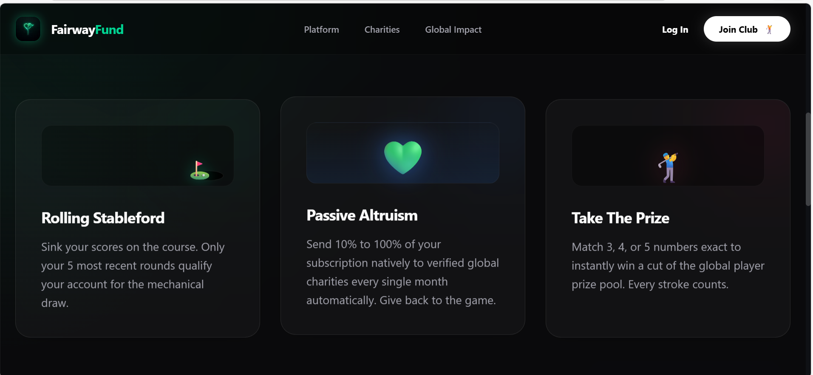
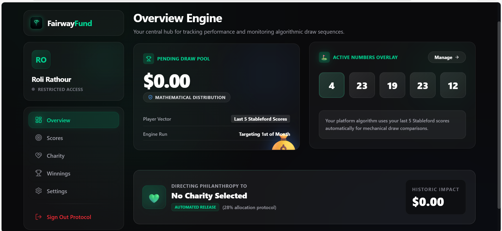
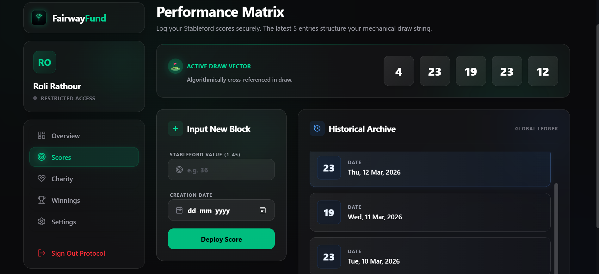

# 🏌️ FairwayFund  
**High-Density Golf × Charity SaaS Platform**

FairwayFund is an ultra-premium SaaS platform that combines **competitive amateur golf**, **algorithm-driven rewards**, and **automated philanthropy** into a single ecosystem.

By submitting your latest **5 Stableford scores**, users enter a **monthly intelligent draw system**, while part of their subscription supports a chosen charity.

---

## ✨ Core Concept

- 🎯 Play → Submit Scores  
- 🎲 Enter → Monthly Draw  
- 💸 Win → Rewards  
- ❤️ Give → Charity  

---

## 🚀 Features

### 🌌 Advanced UI/UX
- Volumetric Glassmorphism design
- Physics-based hover & glow effects
- Cursor tracking gradients
- Premium SaaS feel

---

### 🧠 Draw Engine
- Monthly draw system
- Score-based participation
- Reward tiers:
  - 5-match (Jackpot)
  - 4-match
  - 3-match

---

### ⛳ Score Management
- Store latest 5 scores
- Auto-replace oldest score
- Reverse chronological order
- Range: 1–45 (Stableford)

---

### 💳 Subscription & Payments
- Monthly & yearly plans
- Stripe Checkout integration
- Secure payment flow

---

###  Charity System
- Select charity at signup
- Minimum 10% contribution
- Adjustable donation %

---

###  Dashboard
- Subscription status
- Score tracking
- Charity selection
- Draw participation
- Winnings overview

---

### 🛠 Admin Panel
- User management
- Draw control
- Charity management
- Winner verification
- Analytics

---

##  Tech Stack

- **Frontend**: Next.js 15, React 19, TypeScript  
- **Styling**: Tailwind CSS v4, Lucide Icons  
- **Backend**: Supabase (PostgreSQL + Auth + RLS)  
- **Payments**: Stripe  

---

